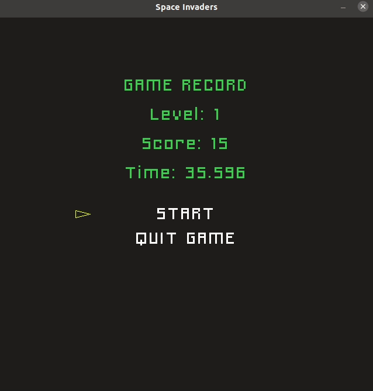

# CppND Capstone Space Invaders

This repo contains my capstone project for the [Udacity C++ Nanodegree.](https://www.udacity.com/course/c-plus-plus-nanodegree--nd213)

The project is a version of the popular game space invaders. 
The game was built from the repository [Snake Game.](https://github.com/udacity/CppND-Capstone-Snake-Game)

In each game 15 enemies are thrown. If you destroy them all, you go to the next level, where the fall speed of the enemies is increased. Si un enemigo impacta contigo, la partida vuelve al nivel 1.

## Controls
1. Left Arrow, Right Arrow to move the player
2. Space Bar to shoot

## Dependencies for Running Locally
* cmake >= 3.7
  * All OSes: [click here for installation instructions](https://cmake.org/install/)
* make >= 4.1 (Linux, Mac), 3.81 (Windows)
  * Linux: make is installed by default on most Linux distros
  * Mac: [install Xcode command line tools to get make](https://developer.apple.com/xcode/features/)
  * Windows: [Click here for installation instructions](http://gnuwin32.sourceforge.net/packages/make.htm)
* SDL2 >= 2.0
  * Linux: `sudo apt-get -y install libsdl2-dev`
  * Mac: `brew install sdl2`
  * Windows: [click here for installation insturctions](https://www.libsdl.org/download-2.0.php)
* SDL2_ttf (loading fonts into textures)
  * Linux: `sudo apt-get -y install libsdl2-ttf-dev`
  * Mac: `brew install sdl2_ttf`
  * Windows: [click here for installation insturctions](https://www.libsdl.org/projects/SDL_ttf/index.html)
* gcc/g++ >= 5.4
  * Linux: gcc / g++ is installed by default on most Linux distros
  * Mac: same deal as make - [install Xcode command line tools](https://developer.apple.com/xcode/features/)
  * Windows: recommend using [MinGW](http://www.mingw.org/)

## Basic Build Instructions

1. Clone this repo.
2. Make a build directory in the top level directory: `mkdir build && cd build`
3. Compile: `cmake .. && make`
4. Run it: `./SpaceInvaders`.

## Code Structure

#### Main.cpp
Defines the constants creates Renderer, Controller, Game and launches the game.
It consists of an infinite loop where the menu is displayed. If the player selects start the game starts, if he selects exit the game ends.

#### Renderer.cpp
This class render each frame of the game and is also in charge of rendering the menu screen and the information texts that are displayed

#### Controller.cpp
This class handle the keyboard and mouse events.

#### Rectangle.cpp
Parent class of the classes Player, Enemy and Projectile. This class handle the position and the speed of this objects.

#### Game.cpp
Contains the loop of the game. In this the enemies and player are created. Collisions are checked and player, enemy, and projectile positions are updated. At the end of the game it is checked if there is a new record and if there is, it is saved in a file.

#### Button.cpp
Class for render the game menu buttons. Contains the positions x and y, the text of the button and if is active or not.

## Rubric Points

**The project demonstrates an understanding of C++ functions and control structures.**
For example, the game class contains while, for and range based for loops and all code is divided into functions.

**The project reads data from a file and process the data, or the program writes data to a file.***
In main.cpp lines 36 to 44 reads a file. In game.cpp the program writes data to a file in the function SaveRecord() at line 309.

**The project accepts user input and processes the input.**
In the Controller class the program accepts user inputs and processes them.

**The project uses Object Oriented Programming techniques.**
The project is divided in multiple classes.

**Class constructors utilize member initialization lists.**
In all classes the diferent constructors use member initialization lists.

**Classes use appropriate access specifiers for class members.**
All class members are specified either public, protected or private.

**Derived class functions override virtual base class functions.**
In class Rectangle the function UpdatePosition is override in child classes Player, Enemy and Projectile.

**The project makes use of references in function declarations.**
The function Run of Game class receive two parameters by reference. The function RenderMenu of Renderer class also receive two parameters by reference.

**The project uses scope / Resource Acquisition Is Initialization (RAII) where appropriate.**
The renderer object is created on the stack and its destructor is called automatically
